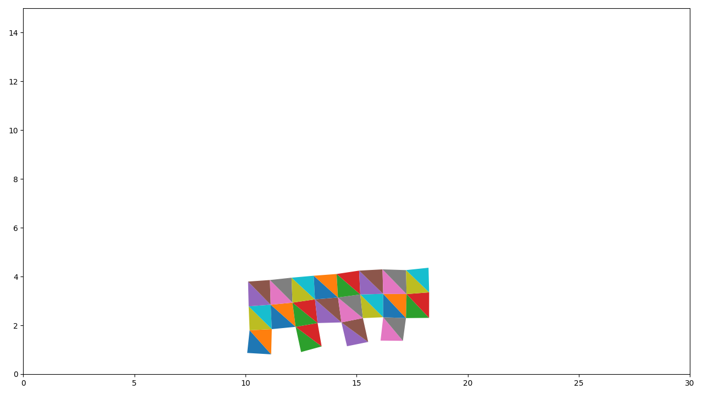
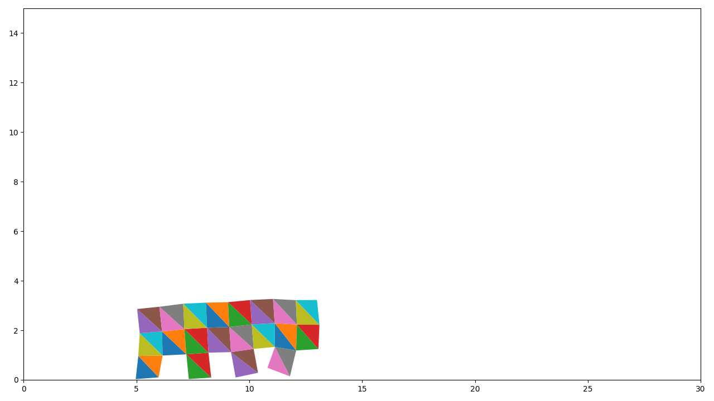

# Linear FEM (C++ Version)


Linear Finite Element Method (FEM) for simulating hyperelastic cubes, all codes are based on pure C++.

## Overview 

| Constitutive Models |  Time Integration | Multiple cubes  | 
| :------------- | :----------: | :----------: | 
| St. Venant-Kirchhoff        |    Symplectic/Implict Euler   | Yes  |
| Neohookean elasticity       |    Symplectic/Implict Euler   |  Yes |

## Requirements  
```shell
Eigen3
matplotlibcpp (for visualization)
```

## Reference
[Matplotlib for C++](https://matplotlib-cpp.readthedocs.io/en/latest/)

[Eigen](https://eigen.tuxfamily.org/index.php?title=Main_Page)

[FEM Simulation of 3D Deformable Solids: A practitioner's guide to theory, discretization and model reduction](http://viterbi-web.usc.edu/~jbarbic/femdefo/)